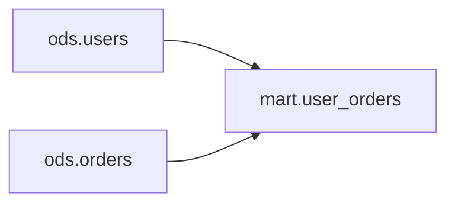
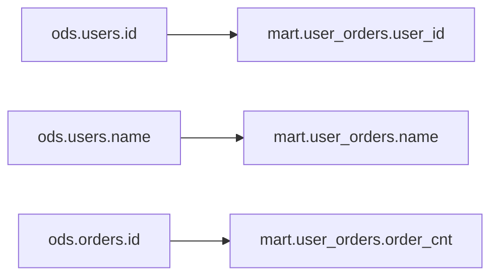
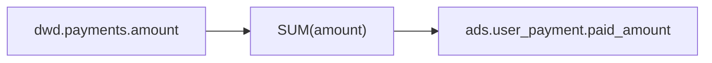

# SQL Lineage Output Format

Use this structure for the Markdown lineage document. Keep the report readable, but do not omit uncertainty. The final deliverable should be a `.md` file unless the user explicitly asks for inline-only output.

## 1. 摘要

State the target object, source objects, main transformation purpose, and whether the analysis is complete.

## 2. 表级血缘

Use a table:

| 目标对象 | 上游对象 | 关系类型 | 关键逻辑 | 置信度 |
|---|---|---|---|---|

Relationship types include `read`, `join`, `aggregate`, `filter_dependency`, `insert`, `merge`, `create_as_select`, `view`.

## 3. 表级血缘图

Include a Mermaid graph:

Graph rules:

- Use `flowchart LR` for left-to-right lineage.
- Use upstream tables on the left and target tables on the right.
- Include CTEs or temp views as intermediate nodes when they explain the path.
- Keep node IDs simple ASCII (`source_1`, `cte_paid`, `target_1`) and put real names in labels.

## 4. 字段级血缘

Use a table:

| 目标字段 | 来源字段 | 转换逻辑 | 影响条件 | 置信度 |
|---|---|---|---|---|

Guidelines:

- `来源字段` may contain multiple columns when the output is computed from several inputs.
- Put constants, literals, parameters, and runtime variables in `转换逻辑`, not `来源字段`.
- Put `WHERE`, `JOIN ON`, `HAVING`, and partition predicates in `影响条件` when they affect which rows reach the target.
- Mark `SELECT *` as incomplete unless source schemas are provided.

## 5. 字段级血缘图

Include a Mermaid graph for important fields:

For transformed fields, label the edge or add an intermediate transformation node:

Graph rules:

- Include all target columns when the SQL is small or medium.
- For very large SQL, include all critical target columns and summarize repeated simple mappings.
- Show constants, `CASE`, `COALESCE`, aggregate functions, window functions, and UDFs as transformation nodes when they materially change the value.
- Show row-level dependencies such as `WHERE` or `JOIN ON` in the table section; include them in the graph only when they are central to understanding the field.

## 6. 中间节点

List CTEs, subqueries, temp views, or aliases:

| 节点 | 类型 | 直接上游 | 输出字段/说明 |
|---|---|---|---|

## 7. 关键处理逻辑

Summarize joins, filters, aggregations, windows, unions, deduplication, case expressions, and merge/update/delete branches.

## 8. 不确定性和需要补充的信息

Call out:

- parser failures
- unknown dialect
- dynamic SQL or macros
- unresolved `*`
- unqualified columns with multiple possible source tables
- missing schema metadata
- runtime variables or templating

## Confidence Rules

- `high`: Explicit qualified source columns or unambiguous single-source columns.
- `medium`: Inferred from aliases or context, but source schema is missing.
- `low`: Depends on `SELECT *`, dynamic SQL, macros, ambiguous names, or parser recovery.
